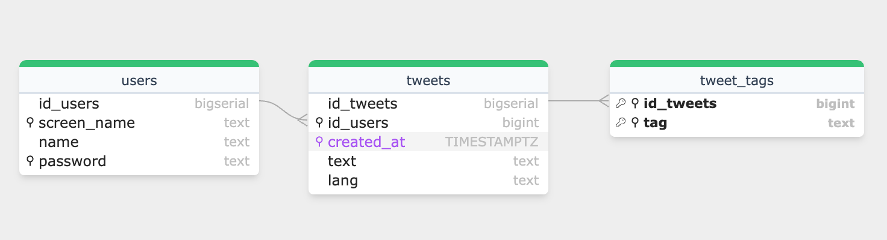

# Twitter Clone

[](https://github.com/tylerheadley/twitter-clone/actions/workflows/tests.yml)

## Table of Contents

1. [Overview](#overview)
2. [Tech Stack](#tech-stack)
3. [Data](#data)
4. [Features](#features)
5. [Schema](#schema)
6. [Indexes](#indexes)
7. [Build Instructions](#build-instructions)

## Overview 

This project replicates Twitter's core functionality using Instagram's basic architecture and tech stack. For this project, I practiced using many skills and technologies that are useful for software engineers and data scientists.

See the live website [here](http://ec2-52-15-240-149.us-east-2.compute.amazonaws.com/), hosted using an AWS EC2 instance. **Note: do not use a real password when creating an account. Passwords are not currently hashed.**

## Tech Stack 

 - Python: Used for backend development.
 - Flask: Micro web framework used for server-side logic.
 - HTML/CSS: Frontend design and styling.
 - Jinja2: Templating engine for rendering dynamic content.
 - PostgreSQL: Database management system.
 - Docker (+ Docker Compose): Containerization for development and production environments.
 - Nginx: High-performance web server and reverse proxy server.
 - Gunicorn: WSGI (Web Server Gateway Interface) HTTP server.
 - AWS EC2: Cloud computing and hosting.
 - GitHub Actions: Implemented for continuous integration.

## Data 

The database is initially seeded with data using a script after spinning up the containers. There are two options for the source of the data. The `data/` folder in this repo contains about 100,000 real tweets from January 1st-10th, 2021. If more data is desired, there is an option to instead insert randomly generated tweets. These tweets consist of 5-12 random english words, followed by 1-4 randomly generated hashtags. 

## Features 

This project seeks to replicate Twitter's core CRUD (Create Read Update Delete) functionaility. This project has 7 endpoints, each facilitating a different primary function:

**Home Page**
 - The home page displays all tweets in the system, along with the user that posted it and the date + time of creation.
 - The most recent 20 messages are displayed, with all older tweets available on subsequent pages.

**Create Account**
 - Displays a form for a user to enter their name, username, and password.
 - Checks whether the username is taken, and that the password confirmation matches
 - If valid, inserts the new user information to the `users` table.

**Login**
  - Checks that entered credentials are valid, and stores them using cookies to keep the user logged in.

**Logout**
 - Deletes the cookies containing the user's credentials.

**Create Message**
 - Inserts the message entered into the `tweets` table, and the message is made visible at the top of the homepage.

**Search**
 - Uses full text search to find and display relevant tweets.

**Trending**
 - Displays the top trending hashtags in the system.

## Schema 

To enable this desired functionality, I designed a simple schema, shown in this E-R diagram.



There is also a view not shown in the diagram called `tweet_tags_count` that precomputes the counts for each hashtag usage for quick access later.

## Indexes 

An important part of this project was to carefully design indexes on each table to enable efficient query plans so that user requests can be processed in milliseconds, even when tables contain millions of rows. For the most part, standard B-tree indexes were chosen appropriately so that the optimal query plans would be made possible, but a RUM index (similar to a GIN index but with some improvements) was used for the search functionality to search and rank the most relevant tweets for a given search query. The goal was to choose appropriate indexes so that Index Only Scans would be made possible for all queries and the Merge Join algorithm can be used for JOINs. All indexes used are contained within the [`schema.sql`](services/postgres/schema.sql). For testing, over 10 million rows of data was loaded into the `tweet_tags` table and over 4 million rows into the `tweets` and `users` tables; despite the large quantity of data, all queries used by the web service completed in under a second.

## Build Instruction

**To bring up the services, follow these steps:**

First, clone this repository and navigate to the project directory.

To build and run the development containers:

```
$ docker-compose up -d --build
```

Access the Flask app at http://localhost:1341/.

To stop the containers:

```
$ docker-compose down
```

You may include the -v flag at the end of this command to delete the postgres volume.

For production, use the docker-compose.prod.yml file instead. 
The production environment includes a few differences from the development build. The most substantial difference is the use of Nginx and Gunicorn as a WSGI server.
Note that you will need to add your own `.env.prod.db` text file containing database credentials. My file has 3 environment variables, `POSTGRES_USER`,`POSTGRES_PASSWORD`, and `PGUSER`.

Build and run the production containers, and initialize the PostgreSQL database:

```
$ docker-compose -f docker-compose.prod.yml up -d --build
```

Access the production Flask app at http://localhost:80/.


To stop the production containers:

```
$ docker-compose -f docker-compose.prod.yml down -v
```

To add initial data to the Postgres database, you may use the `load_tweets_parallel.sh` script. The usage for this file is:

```
$ sh load_tweets_parallel.sh [DATA SOURCE (--local_tweets or --random_tweets)] [NUMBER OF TWEETS (positive integer value)]
```

The local tweets option has a maximum of 99,997 tweets.
